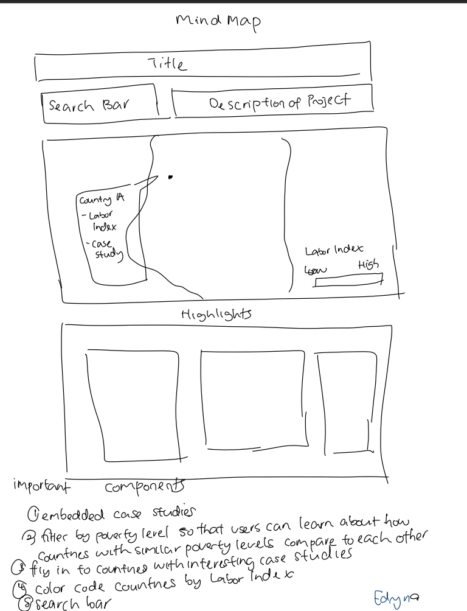

# UX Design

## Mind Maps
| Annika Sial | Edryna Ahmed | Jack Witherspoon | 
|:---:|:---:|:---:|
|  |  |  | 
| We want to include case studies on specic countries to give more background. | The map should speak for itself, but the embedded case studies will be important to showcase some empirical evidence of these two components closely interacting. |  Include a search bar for users to more easily be able to explore the different countries. |

## Crazy Eights

| Annika Sial | Edryna Ahmed | Jack Witherspoon |
|:---:|:---:|:---:|
|  |  |  |
| Our group hopes to implement multiple lays to allow for different types of analysis. |Search bar, colour gradient and filtering countries by poverty level are some propositions targeted to guide the user in exploring the data with ease.. | Add unqiue markers to countries we include case studies on. This will give more background on certian areas. | 
## Storyboard

