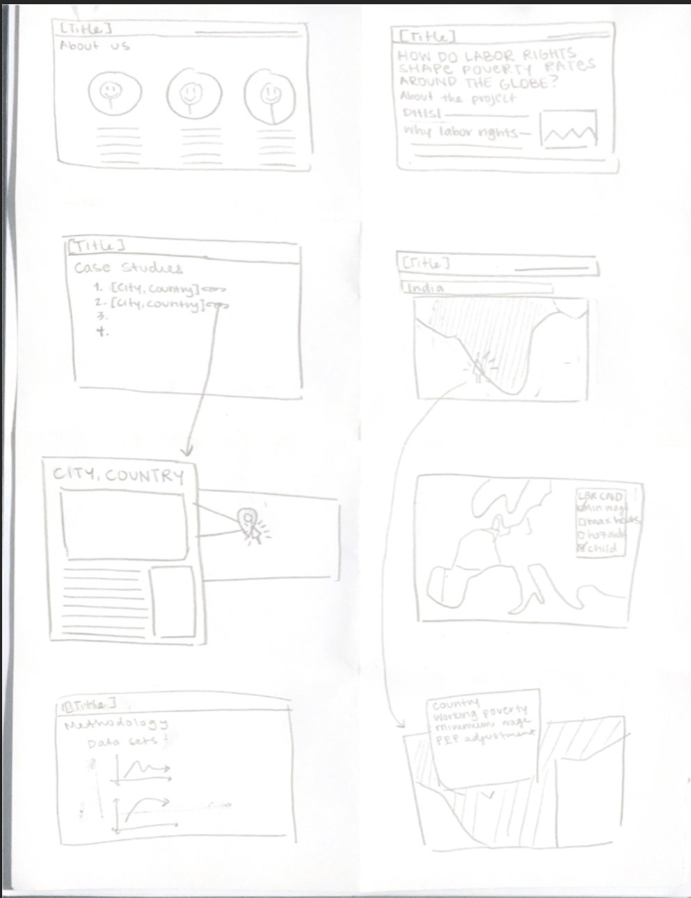
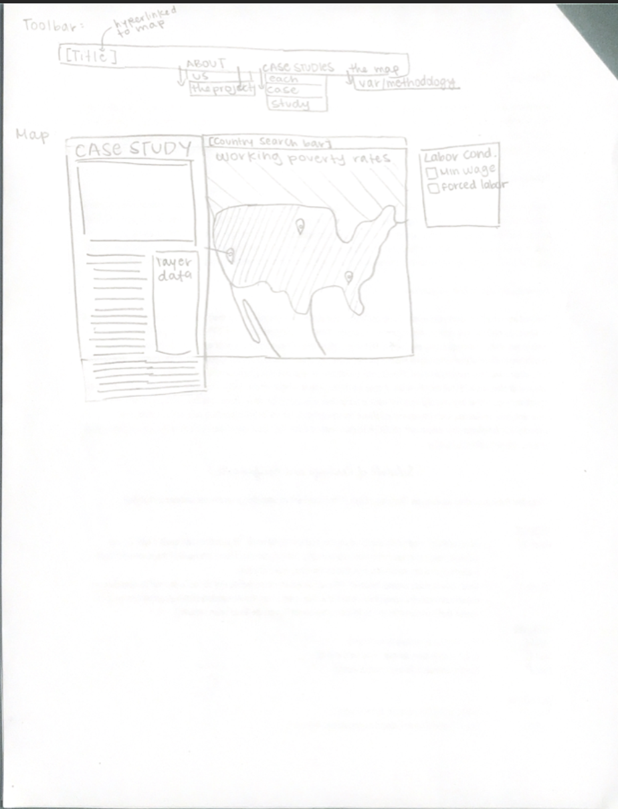

# UX Design

## Mind Maps
| Annika Sial | Edryna Ahmed | Jack Witherspoon | 
|:---:|:---:|:---:|
|  |  |  | 
| Our group hopes to implement multiple lays to allow for different types of analysis. Along with case studies on specic countries to give more background. | Website format will be primarily based on this draft. Closeable sidebar will also be included containing information specific to a borough. | Super neat feature was adding a color-blind option to make the website more accessible to all users. Will also be including ideas about making the map itself more interactive. | Important that we include narrative on our website; while it won't be included on the same page as the map, we will be adding additional subpages to the site that will highlight these details. | 

## Crazy Eights

| Annika Sial | Edryna Ahmed | Jack Witherspoon |
|:---:|:---:|:---:|
|  |  |  |
| Crime density, filters, and icons for types of crime are key ideas we want to implement. | Would be interesting to create interactive charts and graphs on the website, allowing users to see an animated story of the data. | Idea of animating the charts would be great for increasing interactivity. | Would be cool to have a little help icon on the bottom that explains to users what our website does and how to navigate it. | 

## Storyboard

