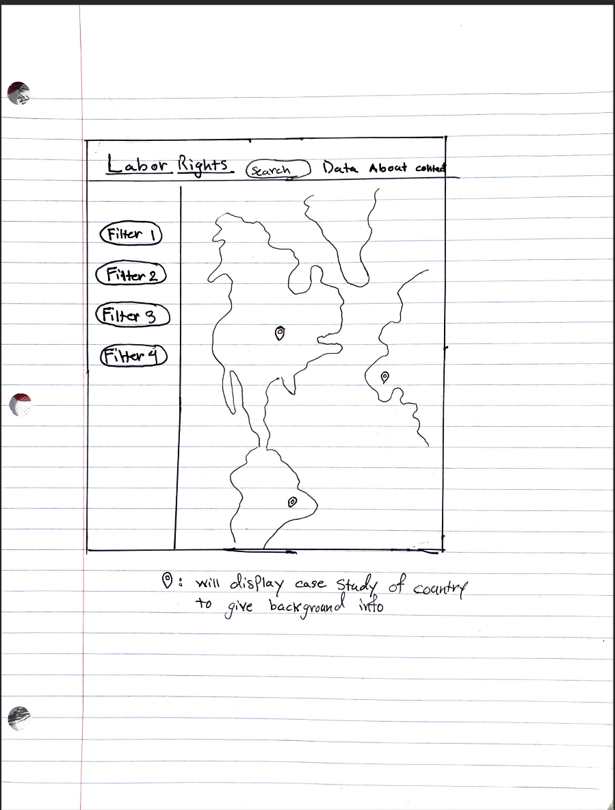
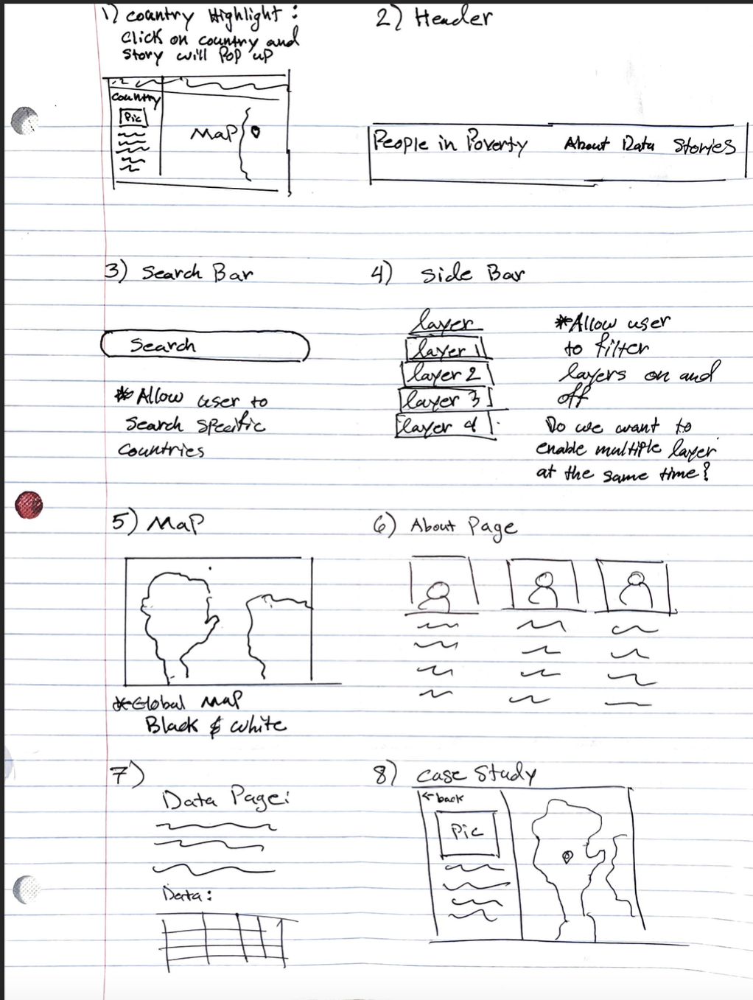
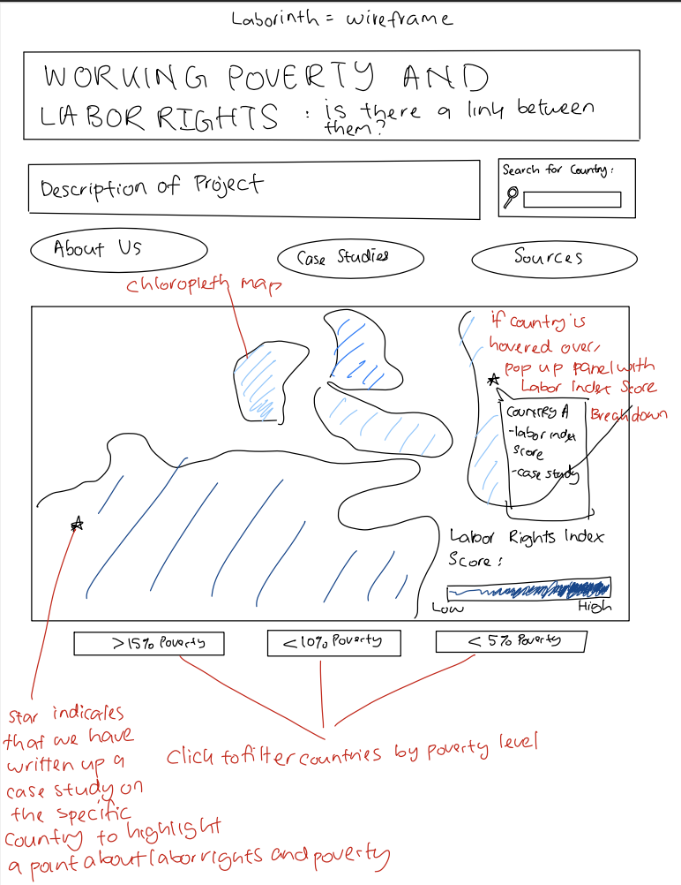
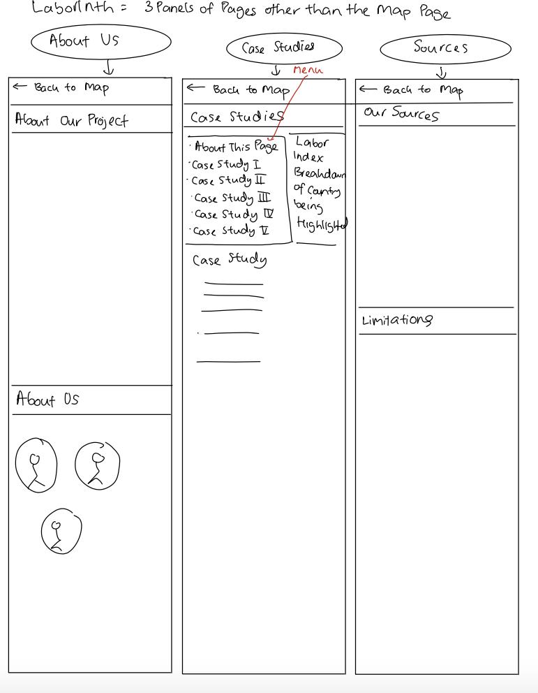

# UX Design

## Mind Maps
| Annika Sial | Edryna Ahmed | Jack Witherspoon | 
|:---:|:---:|:---:|
|  |  |  | 
| We want to include case studies on specic countries to give more background. | Website format will be primarily based on this draft. Closeable sidebar will also be included containing information specific to a borough. |  Include a search bar for users to more easily be able to explore the different countries. |

## Crazy Eights

| Annika Sial | Edryna Ahmed | Jack Witherspoon |
|:---:|:---:|:---:|
|  |  |  |
| Our group hopes to implement multiple lays to allow for different types of analysis. | Would be interesting to create interactive charts and graphs on the website, allowing users to see an animated story of the data. | Idea of animating the charts would be great for increasing interactivity. | Would be cool to have a little help icon on the bottom that explains to users what our website does and how to navigate it. | 

## Storyboard

